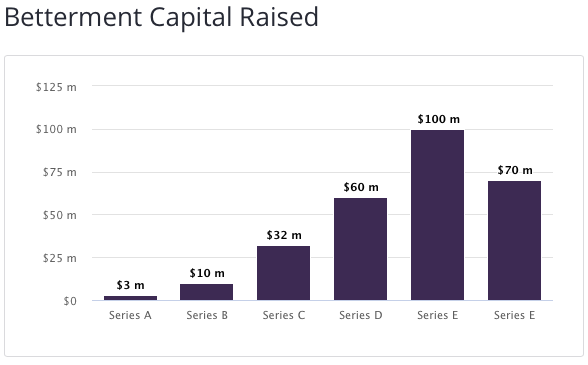
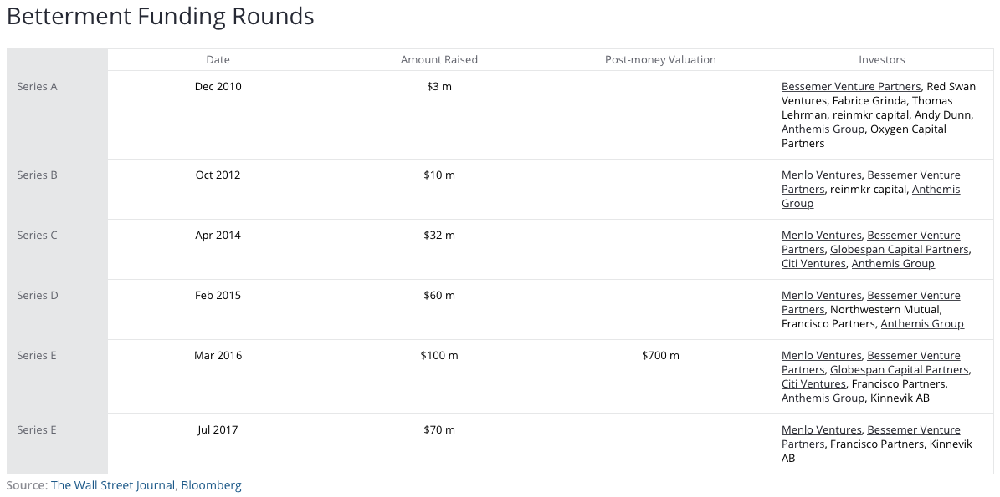
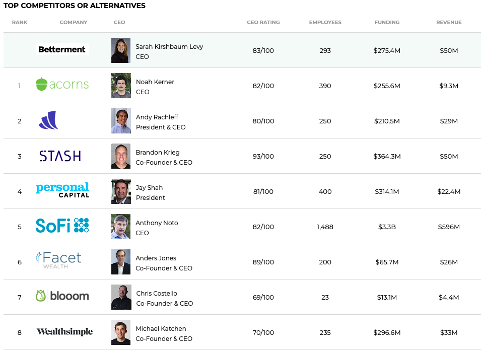
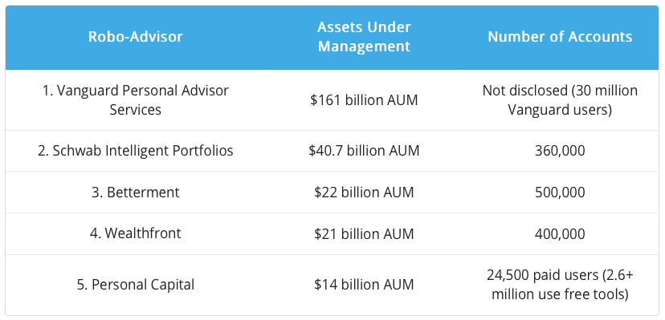

# FinTech Homework

## Overview and Origin

* The company incorporated 2008
* The founders of the company are Jon Stein and Eli Broverman
* The idea for the company (or project) come about from hearing constantly “What should I do with my money?”
* The company was funded by the founders until it launch on TechCrunch, a then did series of funding as follows

*AUM 22 billion USD

## Business Activities:

* What specific financial problem is the company or project trying to solve?

Personal financial advise automation. The “problem” in the financial industry inspired Betterment. The problem that we saw was companies were not thoughtful about how to deliver the best products or be aligned with their customers. Betterment, wants to be the obvious answer to the question “What should I do with my money?” There was no great option on how to invest the right way: automated, low cost, with a great user experience. 
 
* Who is the company's intended customer?  Is there any information about the market size of this set of customers?
What solution does this company offer that their competitors do not or cannot offer? (What is the unfair advantage they utilize?)
Retail Customers
* Which technologies are they currently using, and how are they implementing them? (This may take a little bit of sleuthing–– you may want to search the company’s engineering blog or use sites like Stackshare to find this information.)

## Landscape:

* What domain of the financial industry is the company in?
Personal Financial Advise
* What have been the major trends and innovations of this domain over the last 5-10 years?
Robo Advisors just like Betterment
* What are the other major companies in this domain?
Acorns, WealthFront, Stash, Personal Capital, SoFi, FacetWealth, Blooom, Wealthsimple, Ally, Addepar

## Results

* What has been the business impact of this company so far?

* What are some of the core metrics that companies in this domain use to measure success? How is your company performing, based on these metrics?
Success is measure by AUM, and Betterment is on top as independent RoboAdvisors only succeeded by RoboAdvisors of financial institutions.
* How is your company performing relative to competitors in the same domain?

## Recommendations

* If you were to advise the company, what products or services would you suggest they offer? (This could be something that a competitor offers, or use your imagination!)
Global AUM management, strategies for many contries more.

* Why do you think that offering this product or service would benefit the company?
Yes the company will have further users and more AUM under management.

* What technologies would this additional product or service utilize?
Hard to tell at this point, most likely risk parameter most be change to meet the local country investor necesities.

* Why are these technologies appropriate for your solution?

